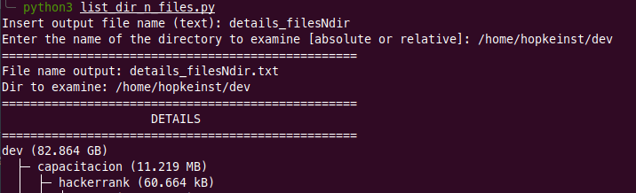
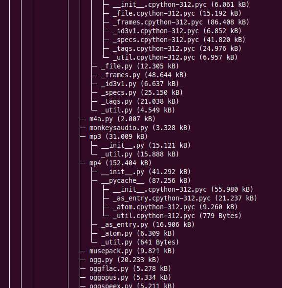
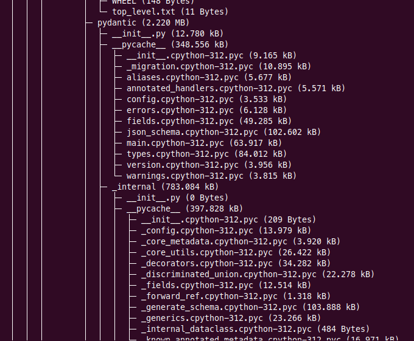
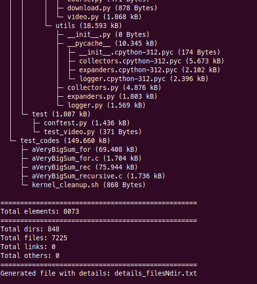
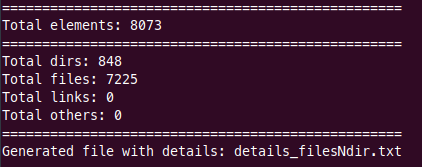

# List directories and files

<h6>Repository</h6>

<h6>@hopkeinst</h6>

----

## Description

Un simple código de herramienta que consiste en obtener un listado de los archivos y directorios dentro de una carpeta en específico. 

Este listado se obtiene en forma de árbol hereditario y obtiene el dato del tamaño de cada uno. En el caso de los directorios del tamaño total de este _(incluyendo su contenido)_, en formato amigable para el ser humano _(tamaño en KiloBytes [KB], MegaBytes [MB], GigaBytes [GB])_.

Al final muestra un resumen del total de directorios y archivos, así como exporta tanto el listado en forma de árbol así como la información final a un archivo, en formato de texto plano _(txt)_.

Los datos del archivo de salido _(nombre)_ y la carpeta a analizar se solicitan al inicio.

----

## Example

Un ejemplo y explicación de funcionamiento se muestra en las siguientes imágenes:

- Se inicia con python, llamando al código. Comienza solicitando el nombre que tenga el archivo en que exportará toda la información y el nombre de la carpeta a examinar:

Al hacerlo, se obtiene una realimentación de la información ingresada y comienza el trabajo, mostrando los detalles. En este caso, la carpeta `dev` tiene un tamaño de 82.864 GigaBytes.

- El árbol jerárquico o hereditario. Se puede ver o seguir las líneas para ver de dónde proviene cada archivo o directorio.

Se puede observar que cuando no hay relación con niveles superiores, no hay líneas que unan estos archivos o directorios, solo lo unen a su padre inmediato.

Esta forma de visualización facilita la ubicación de los archivos y directorios, en un archivo de texto y en la consola donde se ejecute.

Y siempre mostrando el tamaño de cada uno, tanto de los archivos, como por ejemplo `version.cpython-312.pyc` que tiene un peso de `3.956 KB`; así como también de los directorios, como por ejemplo `__pycache__` que todo su contenido tiene un peso de `348.556 KB`.

La finalización del árbol, así como los intermedios en que un archivo o carpeta finaliza esa rama, permite tener un ángulo especial `└` que indica el fin de esa rama.

Y al finalizar todo, se muestran los datos del total de archivos y directorios.

También muestra el nombre del archivo al que se exporta la información.

Un buen ejemplo del archivo exportado está aquí en [details_filesNdir](details_filesNdir.txt) _(tiene muchas línes intermedias eliminadas para no mostrar datos sensibles ni hacer tedioso su comprensión, en la mitad encontrará un área en blanco con puntos suspensivos, es esa área de datos eliminados)_.

----

## Contribución

Espero esta herramienta sea de ayuda y si alguien quiere mejorarla, hablar conmigo para versionarla o similar, con gusto estoy atento a ello _(arriba en la placas están mis datos de contacto)_.

Gracias y disfruta del código !!! 
